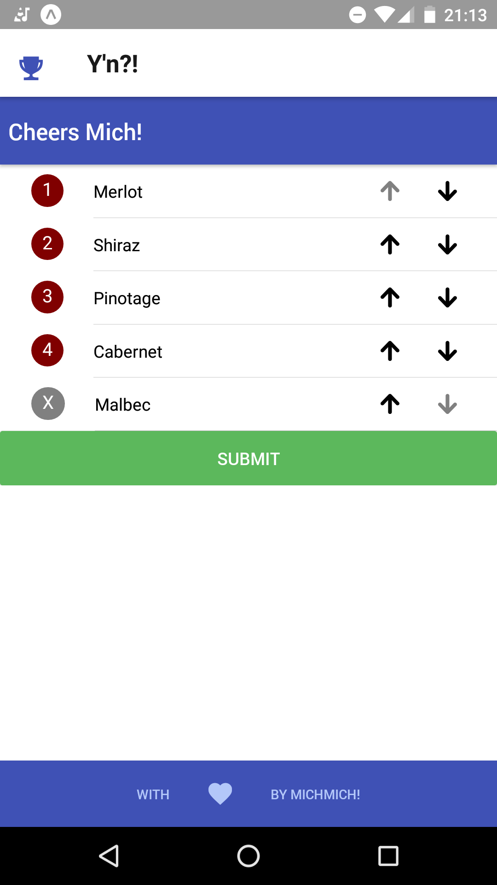
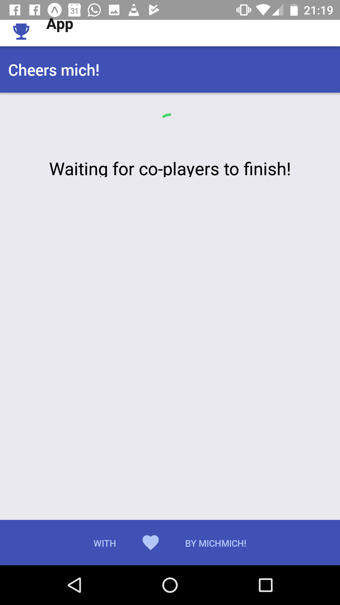
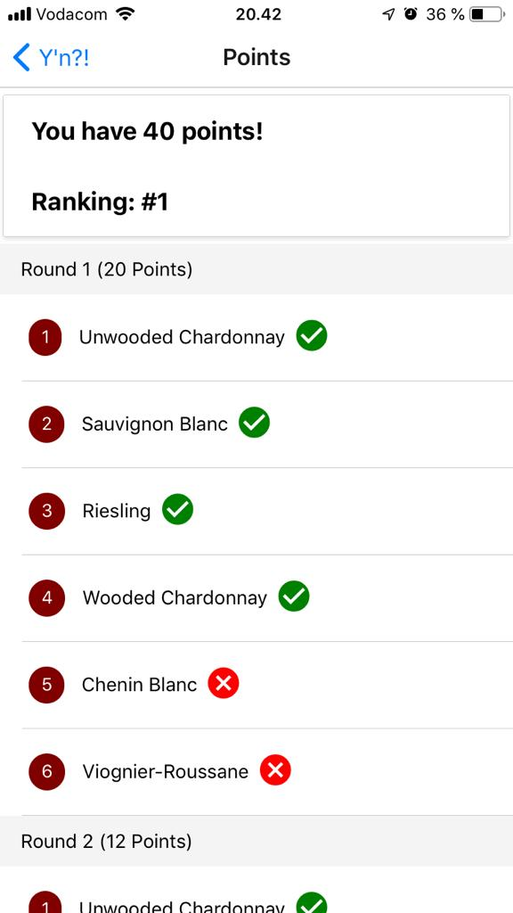
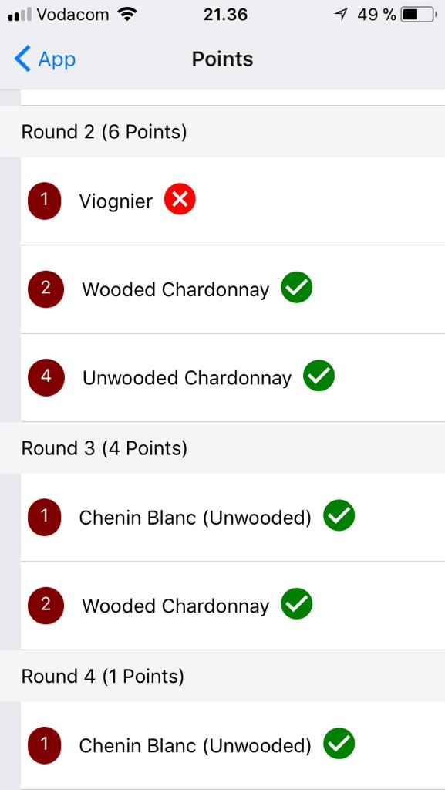
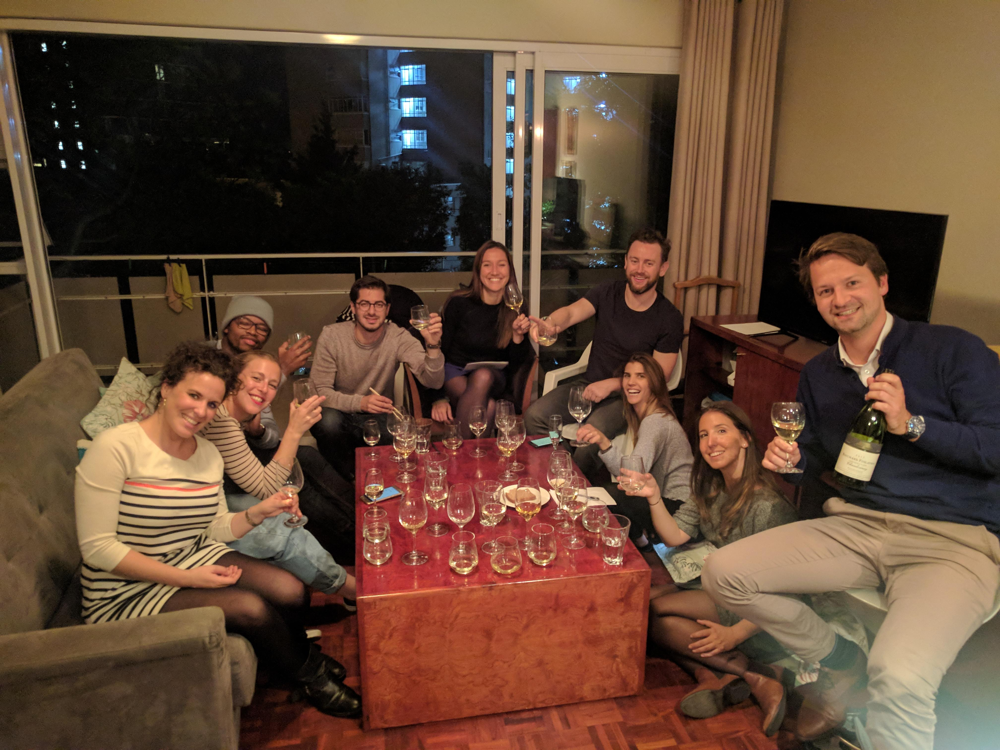

# Blind taster

A gamification of blind-tasting.

At the beginning of a game, there are several wines that distinguish by grape varietal (alternatively by region, price or year).
The wine bottles have to be camouflaged (eg: with paper bags), labeled with numbers and poured into glasses.
Players taste the wines and enter their guesses for the wines into the app.

To make the game more difficult, there might be one "Phantom" wine in the app: for instance a grape varietal that is in t the options to be guessed from, but which is actually not present in any bottle. Players have to guess the phantom wine by labeling it with a `X` in the app.

Once all players have submitted their guesses, the app chooses the wine with the most consensus (ie the lowest entropy in choices) to be revealed.

The revealed wine is entered into the app and points are given for correct guesses.
Points can be earned for the current round but also for correct guesses in previous rounds.
Since at the beginning there are more wines to be guessed, earlier round count for more points.
A leaderboard shows the detailed scores and ranking of the player.

The game continues untill all wines have been revealed.

The app is built in react-native and can be emulated on iOS and Android phones using the expo app.
The server is build in node.js.

Cheers!

